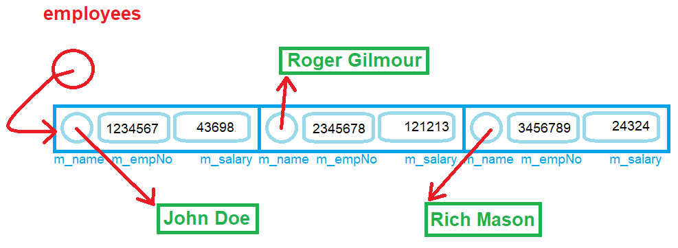

# Workshop #2: Dynamic Memory, References, Overloading

- *Version 1.0*


In this workshop, you will use *references* to modify the content of variables in other scopes, overload functions, allocate memory at run-time and deallocate that memory when it is no longer required. 


## Learning Outcomes

Upon successful completion of this workshop, you will have demonstrated the abilities to:

- allocate and deallocate dynamic memory for an array;
- overload functions;
- create and use references;


## Submission Policy

This workshop is divided into two coding parts and one non-coding part:

- Part 1 (**LAB**): A step-by-step guided workshop, worth 50% of the workshop's total mark
> Please note that the part 1 section is **not to be started in your first session of the week**. You should start it on your own before the day of your class and join the first session of the week to ask for help and correct your mistakes (if there are any).
- Part 2 (**DIY**): A Do It Yourself type of workshop that is much more open-ended and is worth 50% of the workshop's total mark.  
- *reflection*: non-coding part, to be submitted together with *DIY* part. The reflection doesn't have marks associated with it but can incur a **penalty of max 40% of the whole workshop's mark** if your professor deems it insufficient (you make your marks from the code, but you can lose some on the reflection).
- Submissions of part 2 that do not contain the *reflection* (that is the **non-coding part**) are not considered valid submissions and are ignored.

## Due Dates

The Due dates depend on your section. Please choose the "-due" option of the submitter program to see the exact due date of your section:

```bash
~profname.proflastname/submit 2??/wX/pY_sss -due<ENTER>
```
- Replace **??** with your subject code (`00 or 44`)
- Replace **X** with Workshop number: [`1 to 10`]
- Replace **Y** with the part number: [`1 or 2`]
- Replace **sss** with the section: [`naa, nbb, nra, zaa, etc...`]

## Late penalties
You are allowed to submit you work up to 2 days after due date with 30% penalty for each day. After that the submission will be closed and the mark will be zero.

## Citation

Every file that you submit must contain (as a comment) at the top:<br />
**your name**, **your Seneca email**, **Seneca Student ID** and the **date** when you completed the work.

### For work that is done entirely by you (ONLY YOU)

If the file contains only your work or the work provided to you by your professor, add the following message as a comment at the top of the file:

> I have done all the coding by myself and only copied the code that my professor provided to complete my workshops and assignments.

### For work that is done partially by you.

If the file contains work that is not yours (you found it online or somebody provided it to you), **write exactly which part of the assignment is given to you as help, who gave it to you, or which source you received it from.**  By doing this you will only lose the mark for the parts you got help for, and the person helping you will be clear of any wrongdoing.

> - Add the citation to the file in which you have the borrowed code
> - In the 'reflect.txt` submission of part 2 (DIY), add exactly what is added to which file and from where (or whom).

> :warning: This [Submission Policy](#submission-policy) only applies to the workshops. All other assessments in this subject have their own submission policies.

### If you have helped someone with your code

If you have helped someone with your code. Let them know of these regulations and in your 'reflect.txt' of part 2 (DIY), write exactly which part of your code was copied and who was the recipient of this code.<br />By doing this you will be clear of any wrongdoing if the recipient of the code does not honour these regulations.

## Compiling and Testing Your Program

All your code should be compiled using this command on `matrix`:

```bash
g++ -Wall -std=c++11 -g -o ws file1.cpp file2.cpp ...
```

- `-Wall`: the compiler will report all warnings
- `-std=c++11`: the code will be compiled using the C++11 standard
- `-g`: the executable file will contain debugging symbols, allowing *valgrind* to create better reports
- `-o ws`: the compiled application will be named `ws`

After compiling and testing your code, run your program as follows to check for possible memory leaks (assuming your executable name is `ws`):

```bash
valgrind --show-error-list=yes --leak-check=full --show-leak-kinds=all --track-origins=yes ws
```

- `--show-error-list=yes`: show the list of detected errors
- `--leak-check=full`: check for all types of memory problems
- `--show-leak-kinds=all`: show all types of memory leaks identified (enabled by the previous flag)
- `--track-origins=yes`: tracks the origin of uninitialized values (`g++` must use `-g` flag for compilation, so the information displayed here is meaningful).

To check the output, use a program that can compare text files.  Search online for such a program for your platform, or use *diff* available on `matrix`.

> Note: All the code written in workshops and the project must be implemented in the **sdds** namespace, unless instructed otherwise.

# PART 1 (50%) Employees Salary Report

***Employees Salary Report*** is a program that reads an unknown number of Employee records from a file and holds these records of Employees in a dynamically allocated array of **Employee**s. (Each record holds the Employee's name, Employee number and Salary of the Employee in a comma-separated value format.)

After loading all the information into a dynamic array of **Employee**s, the program will sort the records based on the Employee number of the Employee in ascending order and prints them on the screen.

## PART 1 Execution example

```text
Employee Salary report, sorted by employee number
no- Empno, Name, Salary
------------------------------------------------
1- 117493: Bumblebee Man, $43554
2- 238023: Alice Glick, $15310
3- 261382: Artie Ziff, $44801
4- 268411: Bernice Hibbert, $27776
5- 463877: Allison Taylor, $93971
6- 529967: Abraham Simpson, $80084
7- 543817: Barney Gumble, $54858
8- 737371: Agnes Skinner, $32943
9- 760089: Akira Kurosawa, $55772
10- 811518: Baby Gerald, $90670
11- 836915: Apu Nahasapeemapetilon, $63415
12- 881837: Bart Simpson, $47608
13- 928072: Carl Carlson, $23678
14- 954291: Brandine Spuckler, $51499
```

This program is partially developed; you can find all the files in the lab directory. Your responsibility is to complete the code as stated in the workshop. 

## The Code

The structure holding the Employee record is designed as follows:

```C++
struct Employee {
  char* m_name;
  int m_empNo;
  int m_salary;
};
```

In addition to holding the employee records in a dynamically allocated array of `Employee`s, each employee's name is also held in a dynamically allocated C-style string in the **Employee** structure. Consider the following visual and note that every circle with an arrow in this diagram shows dynamic memory in use.


  

## Data file  

The data in the file has the following format:

```Text
EMPLOYEE NUMBER,SALARY,NAME<NEWLINE>
```

and this is a sample file:

```Text
529967,80084.0,Abraham Simpson
737371,32943.0,Agnes Skinner
760089,55772.0,Akira Kurosawa
238023,15310.0,Alice Glick
463877,93971.0,Allison Taylor
836915,63415.0,Apu Nahasapeemapetilon
261382,44801.0,Artie Ziff
811518,90670.0,Baby Gerald
543817,54858.0,Barney Gumble
881837,47608.0,Bart Simpson
268411,27776.0,Bernice Hibbert
954291,51499.0,Brandine Spuckler
117493,43554.0,Bumblebee Man
928072,23678.0,Carl Carlson
```


### The Modules

There are three modules in the program: `File`, `Employee` and `main`.


#### `File` Module

This modules contains functions that facilitate working with files to read data. The module has one global variable called `fptr`. This File pointer is used to point to the datafile for the application.

The following functions are already implemented in the `File` module:

- `openFile`: Opens the data file for reading  
- `closeFile`: Closes the data file
- `noOfRecords`: Returns an integer that is the number of records in the file; use this function in the `Employee` module to determine the size of the dynamic array of employees.


***Your coding responsibility in the `File` module:***

Implement 3 **overloads** of a function called `read`:

1. `read` function: as a parameter, this function accepts a reference of character pointer. (`char*& name`); this reference will be used to set the dynamic name of the employee to the name stored in the file. To accomplish this, in a local array of 128 characters read (fscanf) from the file the name of the employee (up to 127 characters). Then if the scan was successful (if fscanf returned 1) set the reference parameter of the function to a dynamic memory equal to the length of the scanned name (+1) and copy the name into it. 

    Returns `true` if the read was successful, `false` otherwise.

    Use the following `fscanf` function to read the name of the employee (up to the newline and skipping it) from the file. See more information [here](https://en.cppreference.com/w/cpp/io/c/fscanf).

    ```C
    fscanf(file_pointer, "%127[^\n]\n"......
    ```

2. `read`: accepts as a parameter, a **reference** to an integer representing the employee number. Reads from the file the employee number and stores it in the parameter.

    Returns `true` if the read was successful, `false` otherwise.

    Use the following `fscanf` function to read the number from the file (skipping the comma) and return true if `fscanf` returns 1. See more information [here](https://en.cppreference.com/w/cpp/io/c/fscanf).

    ```C
    fscanf(fptr, "%d,".......
    ```

3. `read`: accepts as a parameter, a **reference** to a double precision number representing the employee's salary. Reads from the file the employee salary and stores it in the parameter.

    Returns `true` if the read was successful, `false` otherwise.

    Use the following `fscanf` function to read the salary from the file (skipping the comma) and return true if `fscanf` returns 1. See more information [here](https://en.cppreference.com/w/cpp/io/c/fscanf).

    ```C
    fscanf(fptr, "%lf,",......
    ```


#### `Employee` Module


The `Employee` module has two global variables:
  ```cpp
  // Holds the number of records (employees) in the file.
  // Should be used (after setting) to allocate the dynamic array of Employees.
  int noOfEmployees;
  
  // Holds the address of the dynamically-allocated array of employees.
  //   The size of the array is "noOfEmployees".
  Employee* employees;
  ```


The function `sort` has been already implemented. This function sorts the array of employees based on the employee number.


***Your coding responsibility in the `Employee` module.***

Implement following functions:

- `load`: receives as a parameter, a reference to an object of type `Employee`, loads from the file the information about the employee and returns `true` if it was successful (`false` otherwise).

    - Calls the three overloaded read functions and sets the three attributes of the Employee; (employee number, salary and name) in the order of their corresponding data in the file. If all three reads return true, this function will return true, otherwise, it returns false.
    
- `load`: an overload of the `load` function with no parameters. This function should dynamically allocate memory for an array of `Employee`s and read all the records of the file into the dynamic array's elements as follows:
    - open the file (use function(s) from the `File` module), if not successful print the following error message and exit the function returning false; `"Could not open data file: data_file_name" + newline`, otherwise to the following:
    - get the number of records (employees) from the file (use the function(s) from the `File` module) and store it in the global variable.
    - create a dynamically allocated array of `Employee` to the number of the records in the file and hold its address in the corresponding global variable.
    - load each record from the file and store it in the array elements.
    - if everything is loaded correctly, return `true`.
    - if something goes wrong during data loading, display the following error message, deallocate all the memory and return `false`.
    ```text
    Error: incorrect number of records read; the data is possibly corrupted.
    ```
    - before exiting the function make sure to close the opened file (use function(s) from the `File` module).


- `display`: receives as a parameter, a constant reference to an Employee object and prints it in the following format on ostream:
    ```text
    NUMBER: NAME, $SALARY<NEWLINE>
    ```

- `display`: an overload of the `display` function that receives no parameters and returns nothing. This function should:
    - print to screen (using ostream and not printf)
    ```text
    Employee Salary report, sorted by employee number
    no- Empno, Name, Salary
    ------------------------------------------------
    ```
    - sort the array
    - iterate over the sorted array an print each employee in this format:
    ```text
    IDX- NUMBER: NAME, $SALARY<NEWLINE>
    ```
    - see [sample output](#part-1-execution-example) for more details.

- `deallocateMemory`: deallocate **all** the memory used by the the dynamic array of employees (make sure to first deallocate the names and then the array).
    1. Goes through the dynamic array of `Employee`s and deletes all the names of the Employees.
    2. Deletes the dynamic array of `Employee`s.


### The Salary Report (the `main` Module)

This module is already provided. Look at it, make sure you understand it, and do not change it.


## PART 1 Submission 

### Files to submit:  

```Text
main.cpp 
File.cpp
File.h
Employee.cpp
Employee.h
```

Upload your source code and `employee.csv` to your `matrix` account. Compile and run your code using the `g++` compiler as shown in [Compiling and Testing Your Program](#compiling-and-testing-your-program) and make sure that everything works properly.

Then, run the following command from your matrix account

```bash
~profname.proflastname/submit 2??/wX/pY_sss  <ENTER>
```
- Replace **??** with your subject code (`00 or 44`)
- Replace **X** with Workshop number: [`1 to 10`]
- Replace **Y** with the part number: [`1 or 2`]
- Replace **sss** with the section: [`naa, nbb, nra, zaa, etc...`]

and follow the instructions.


> **⚠️Important:**  Please note that a successful submission does not guarantee full credit for this workshop. If the professor is not satisfied with your implementation, your professor may ask you to resubmit. Re-submissions will attract a penalty


# PART 2 - DIY (50%) postal-code-based population report

Write a **postal-code-based population report** program that reads a series of records of postal codes and their population in Canada from a comma-separated-values file into dynamically allocated memory and prints a report of selected postal codes and their population sorted in an ascending order and the total population of the listed postal codes. 

The program must ask for the prefix of a Canadian postal code. The user will then enter "all" or 1 to 3 characters. If all is entered then all the postal codes in the file will be displayed, if 1 to 3 letters of the postal code are entered, then only those postal codes that match the letter will be printed.

For example if user Enters `L4`, then all the postal code records that start with `L4` will be listed.

If the user enters `!`, the program ends;

The data file is called `PCpopulations.csv` and is formatted as follows:
  
```Text
Three First Characters of the postal code
comma
population
newline
```

Example:

```Text
A0A,46587
A0B,19792
A0C,12587
A0E,22294
A0G,35266
A0H,17804
A0J,7880
A0K,26058
A0L,7643
A0M,6200
A0N,13815
A0P,13721
A0R,2543
A1A,30382
A1B,19867
```

## DIY Execution example (with the short sample file)
```text
Population Report
-----------------
Enter postal code:
> A1
Postal Code: population
-------------------------
1- A1B:  19867
2- A1A:  30382
-------------------------
Population of the listed areas: 50249

Population Report
-----------------
Enter postal code:
> all
Postal Code: population
-------------------------
1- A0R:  2543
2- A0M:  6200
3- A0L:  7643
4- A0J:  7880
5- A0C:  12587
6- A0P:  13721
7- A0N:  13815
8- A0H:  17804
9- A0B:  19792
10- A1B:  19867
11- A0E:  22294
12- A0K:  26058
13- A1A:  30382
14- A0G:  35266
15- A0A:  46587
-------------------------
Population of the listed areas: 282439

Population Report
-----------------
Enter postal code:
> ABC
Postal Code: population
-------------------------
-------------------------
Population of the listed areas: 0

Population Report
-----------------
Enter postal code:
> AB
Postal Code: population
-------------------------
-------------------------
Population of the listed areas: 0

Population Report
-----------------
Enter postal code:
> !
```

Implement this program in 3 modules called `main`, `File` and `Population` that can accomplish the above task.  


***You may freely use or copy any logic or code needed from the PART 1 section!***


## `File` Module

The `File` module is partially implemented. 

## `Population` Module

The `Population` module is not implemented. 
> Only one function is implemented to help identifying matching postal codes.

## Mandatory functions to implement

```c++
bool getPostalCode(char* postal_code_prefix)
```

Prints the following prompt: 

```text
Population Report
-----------------
Enter postal code:
> 
```

and receives a user entry for a partial postal code prefix into the `postal_code_prefix` address. If the user enters `!` it returns false, otherwise it will return true.     

No validation is needed for the user entry; we assume the user will not enter invalid information.

```c++
bool load(const char* filename, const char* partial_postal_code_prefix);
```

Loads all the records with the postal code that starts with `partial_postal_code_prefix` into a dynamically allocated array of `Population`. The size of the dynamic array must be equal to the number of matches.


```c++
display();
```
A function with no parameters that returns nothing and prints the report as shown in [DIY Execution example](#diy-execution-example-with-the-short-sample-file).

```c++
deallocateMemory();
```
A function with no parameters that return nothing and deallocates **all** the dynamic memory used by the program.


## Reflection

Study your final solutions for each deliverable of the workshop, reread the related parts of the course notes, and make sure that you have understood the concepts covered by this workshop.  **This should take no less than 30 minutes of your time and the result is suggested to be at least 150 words in length.**

Create a file named `reflect.txt` that contains your detailed description of the topics that you have learned in completing this workshop and mention any issues that caused you difficulty.

You may be asked to talk about your reflection (as a presentation) in class.

## DIY Submission (part 2)

### Files to submit:  

```Text
main.cpp <--- do not modify this.
File.cpp
File.h
Population.cpp
Population.h
```
> When submitting, your program will be tested against a data file similar to `PCpopulations.csv`.

> To test and demonstrate the execution of your program use the same data as shown in the [PART 1 Execution example](#part-1-execution-example) .

Upload your source code and data file to your `matrix` account. Compile and run your code using the `g++` compiler as shown in [Compiling and Testing Your Program](#compiling-and-testing-your-program) and make sure that everything works properly.

Then, run the following command from your matrix account

```bash
~profname.proflastname/submit 2??/wX/pY_sss  <ENTER>
```
- Replace **??** with your subject code (`00 or 44`)
- Replace **X** with Workshop number: [`1 to 10`]
- Replace **Y** with the part number: [`1 or 2`]
- Replace **sss** with the section: [`naa, nbb, nra, zaa, etc...`]

and follow the instructions.


> **⚠️Important:**  Please note that a successful submission does not guarantee full credit for this workshop. If the professor is not satisfied with your implementation, your professor may ask you to resubmit. Re-submissions will attract a penalty

